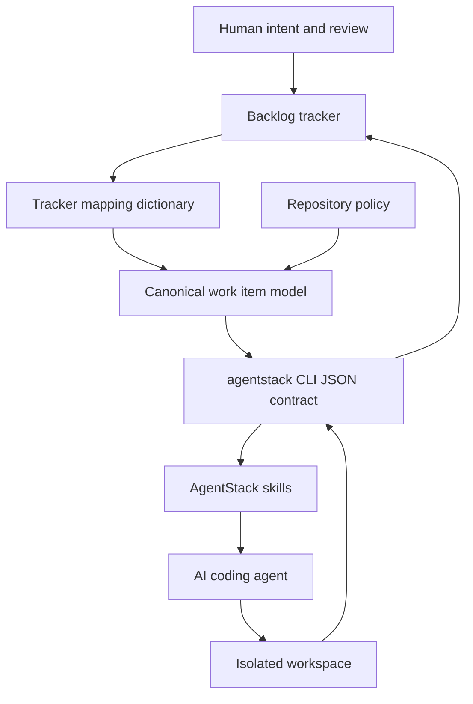

# AgentStack CLI

`@agentstack/cli` provides the `agentstack` command-line tool for AgentStack Protocol: a repository-local collaboration protocol for humans and AI coding agents working from tracker-backed backlog items.

AgentStack exists to keep agents out of tracker-specific guesswork. Agents read and write work through one canonical CLI contract, while each repository owns the language, policy, mapping, and skills that define how work should be executed.

## Documentation

| Document | Purpose |
| --- | --- |
| [Command Reference](docs/commands.md) | Command syntax, flags, output shape, and examples. |
| [Usage Manual](docs/usage.md) | Setup, agent execution, concurrent worktrees, blockers, review submission, and smoke tests. |
| [Architecture](docs/architecture.md) | Internals for contributors and agents developing this project. |
| [Future Evolution](FUTURE-EVOLUTION.md) | Roadmap and longer-term design direction. |

The CLI help is the source of truth for command contracts:

```sh
agentstack help
agentstack help work-item claim
agentstack help work-item claim --json
```

The markdown docs explain the workflows and architecture around that live contract.

## Philosophy

AgentStack separates four concerns that are often tangled together in agent workflows:



The important design choices are:

- **Repository-local protocol**: each product repository carries its own `.agent-stack` assets and `.agents/skills`.
- **Canonical backlog language**: agents reason in stable AgentStack terms instead of GitHub labels or Azure DevOps tags.
- **Tracker mappings**: tracker-native fields, labels, tags, and relations are translated into canonical work item concepts.
- **Policy gates**: readiness, acceptance criteria, claims, dependencies, blockers, and human review are enforced through explicit repository policy.
- **Isolated execution**: concurrent agents work in separate git worktrees or equivalent isolated workspaces.
- **Human-controlled merge**: completed agent work is submitted for review; humans decide merge by default.
- **Explicit post-review paths**: approved completion and requested-changes rework are handled by dedicated AgentStack skills.

## Install

```sh
npm install -g @agentstack/cli
```

Requirements:

- Node.js 20 or newer.
- Git for repository setup and worktree-based workflows.
- GitHub CLI (`gh`) when using the GitHub tracker profile.
- Azure CLI plus `azure-devops` extension when using the Azure DevOps tracker profile.

## Quick Setup

Most repositories use exactly one backlog tracker. Setup deploys only the active tracker profile.

### GitHub

```sh
agentstack setup \
  --target /path/to/product-repo \
  --tracker github \
  --github-repository OWNER/REPO \
  --agents generic \
  --provision-tracker \
  --overwrite
```

`--github-repository` is required unless setup can infer the repository from the target repo's `origin` remote. `--provision-tracker` creates or updates the default AgentStack GitHub labels.

### Azure DevOps

```sh
agentstack setup \
  --target /path/to/product-repo \
  --tracker azure-devops \
  --azdo-organization https://dev.azure.com/ORG \
  --azdo-project PROJECT \
  --agents generic \
  --provision-tracker \
  --overwrite
```

Azure DevOps setup requires `--azdo-organization` and `--azdo-project`. The default Azure DevOps profile uses tags and built-in relation types, so provisioning verifies CLI access instead of creating labels.

After setup:

```sh
agentstack doctor --repo /path/to/product-repo
agentstack language validate --repo /path/to/product-repo
agentstack mapping validate --repo /path/to/product-repo
```

## Repository Footprint

Setup creates or updates:

```text
AGENTS.md
.agent-stack/
  active-tracker.json
  .gitignore
  PROMPTS.md
  README.md
  workspace.json
  protocol/AGENT-PROTOCOL.md
  language/backlog-language.yaml
  policy/AGENT-POLICY.json
  trackers/<active-tracker>.mapping.yaml
  trackers/<active-tracker>.config.json
  templates/markdown-style.md
.agents/
  skills/agentstack-*/SKILL.md
  skills/git-worktree-ops/SKILL.md
```

If `AGENTS.md` already exists, setup preserves it and inserts or updates only the managed block between:

```md
<!-- agentstack-protocol:start -->
<!-- agentstack-protocol:end -->
```

## Agent Workflow

Agents should use the CLI instead of tracker-native commands for normal protocol work:

```sh
agentstack doctor
agentstack work-item get 123
agentstack work-item graph 123
agentstack agent identity init
agentstack work-item claim 123 --branch agentstack/123 --workspace ../repo-worktrees/123
agentstack work-item plan 123 --message "Implement the scoped behavior and validate it."
agentstack work-item progress 123 --message "Implementation started."
agentstack work-item submit-review 123 --pr https://github.com/OWNER/REPO/pull/456
```

All non-setup command output is JSON. See [Usage Manual](docs/usage.md) for the full workflow.

## Local Development

Install dependencies and run the fast validation loop:

```sh
npm install
npm run build
npm run typecheck
npm test
npm pack --dry-run
```

Expose this checkout as the global `agentstack` command without publishing:

```sh
npm install
npm run build
npm link
agentstack --help
```

After changing TypeScript source, rebuild:

```sh
npm run build
```

You can also run the built CLI directly:

```sh
node ./dist/agentstack.js --help
node ./dist/agentstack.js doctor --repo .
```

To remove the global link:

```sh
npm unlink -g @agentstack/cli
```

For contributor and agent internals, see [Architecture](docs/architecture.md).
