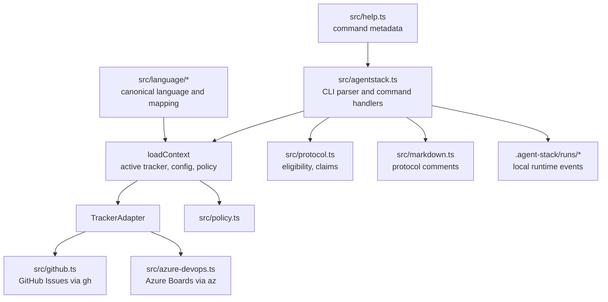
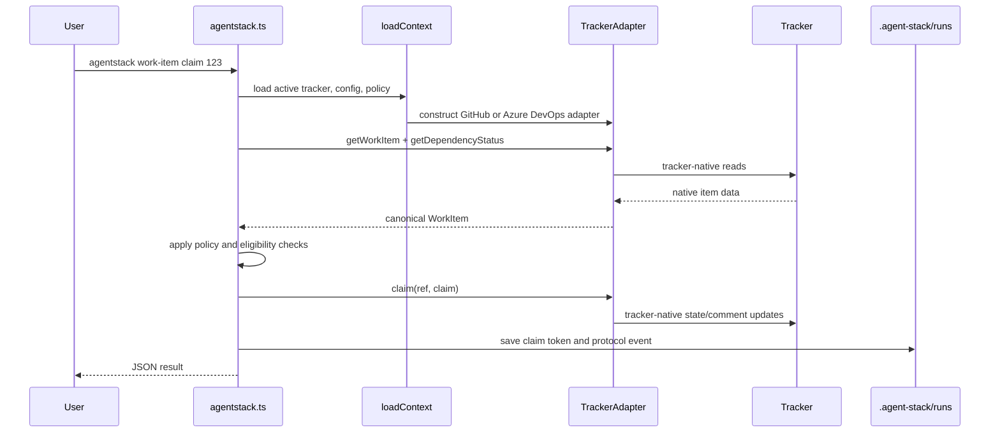
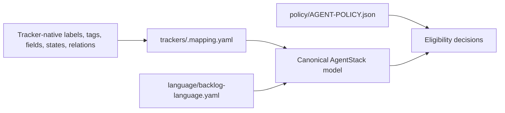

# Architecture

This document is for contributors and agents developing `@agentstack/cli`.

## System Shape



AgentStack has three layers:

- **CLI layer**: argument parsing, command routing, JSON output, setup handoff, and local runtime files.
- **Canonical protocol layer**: work item model, policy, eligibility checks, claims, protocol comments, and events.
- **Tracker adapter layer**: GitHub and Azure DevOps implementations that translate canonical operations into tracker-native commands.

## Source Map

| Path | Role |
| --- | --- |
| `src/agentstack.ts` | Main CLI executable, command handlers, context loading, identity files, runtime event files. |
| `src/help.ts` | Structured command metadata used by human and JSON help. Keep command docs aligned with this file. |
| `src/model.ts` | Canonical work item, relation, claim, platform, and protocol state types. |
| `src/protocol.ts` | Eligibility checks, claim creation, and claim token validation. |
| `src/policy.ts` | Recommended execution policy defaults. |
| `src/tracker.ts` | Tracker adapter interface. |
| `src/github.ts` | GitHub tracker adapter. |
| `src/azure-devops.ts` | Azure DevOps tracker adapter. |
| `src/markdown.ts` | Protocol comment section formatting and Markdown normalization. |
| `src/events.ts` | Local protocol event types. |
| `src/acceptance-criteria.ts` | Acceptance criteria parsing from tracker descriptions. |
| `src/language/canonical.ts` | Required canonical concepts. |
| `src/language/mapper.ts` | Mapping support between tracker-native and canonical concepts. |
| `src/language/mapping.ts` | Mapping data structures. |
| `src/language/validation.ts` | Language and tracker mapping validation. |
| `.agent-stack/install/setup-agent-stack.mjs` | Setup implementation invoked by `agentstack setup`. |
| `.agent-stack/protocol/AGENT-PROTOCOL.md` | Deployable protocol document for product repositories. |
| `.agent-stack/language/backlog-language.yaml` | Deployable canonical backlog language. |
| `.agent-stack/policy/AGENT-POLICY.json` | Deployable default execution policy. |
| `.agents/skills/agentstack-*` | Deployable AgentStack protocol skills. |
| `.agents/skills/git-worktree-ops` | Supporting worktree skill. |
| `tests/*.test.mjs` | Node test suite. |

## Command Execution Flow



## Runtime State

AgentStack writes local runtime state under `.agent-stack`:

| Path | Committed? | Purpose |
| --- | --- | --- |
| `.agent-stack/local/agent-identity.json` | No | Stable local default `agentId`. |
| `.agent-stack/runs/<id>/claim.json` | No | Claim token and claim metadata for one work item. |
| `.agent-stack/runs/<id>/protocol-log.jsonl` | No | Local execution event log. |

Product repositories should commit protocol assets, language, policy, mapping, and skills. They should not commit local identity, claim tokens, or runtime logs.

## Review Lifecycle Boundary

The current CLI intentionally stops at review submission plus protocol state synchronization:

- `work-item submit-review` links reviewable work and sets protocol state `pr-open`.
- `work-item state` can move the protocol state to `implementing`, `in-review`, `done`, or another canonical state.
- `work-item progress` records human-readable follow-up notes.
- `work-item release` removes an active claim marker, but its current wording is release-oriented rather than completion-oriented.

The CLI does not currently merge pull requests, close GitHub issues, move Azure Boards workflow states, or provide a dedicated `complete` command. If that behavior becomes product scope, add it as an explicit command rather than hiding it behind `state`.

A future completion command should probably:

- verify that the PR is merged or merge it only when explicitly authorized;
- set protocol state `done`;
- clear the active claim marker with completion-oriented audit text;
- optionally close or transition the tracker item through tracker-specific adapter behavior;
- emit a local completion event.

## Setup Architecture

`agentstack setup` is implemented as a handoff from `src/agentstack.ts` to `.agent-stack/install/setup-agent-stack.mjs`.

Setup responsibilities:

- deploy `.agent-stack` protocol assets;
- deploy `.agents/skills/agentstack-*` and `git-worktree-ops`;
- install only the selected active tracker profile;
- write tracker config and mapping files;
- merge the AgentStack-managed block into `AGENTS.md`;
- optionally provision or verify tracker-side configuration.

The setup process must preserve existing repository instructions by merging the managed block into `AGENTS.md`, not replacing the whole file.

## Tracker Adapter Contract

Adapters implement canonical operations such as:

- read a work item;
- query eligible work;
- read dependency status;
- claim and release claims;
- set protocol state;
- add protocol comments;
- attach pull requests;
- create child work items.

The CLI should not expose tracker-native details to agents unless those details are part of the canonical model or mapping output. Add new tracker behavior by extending the adapter contract first, then implementing it in each supported adapter.

## Language, Mapping, And Policy



Use `agentstack language validate` when editing `.agent-stack/language/backlog-language.yaml`.

Use `agentstack mapping validate` when editing `.agent-stack/trackers/<tracker>.mapping.yaml`.

Use `agentstack doctor` after setup or cross-cutting changes.

## Development Loop

```sh
npm install
npm run build
npm run typecheck
npm test
npm pack --dry-run
```

During development, expose this checkout globally:

```sh
npm run build
npm link
agentstack --help
```

Run the built CLI directly when testing specific changes:

```sh
node ./dist/agentstack.js help work-item claim --json
node ./dist/agentstack.js doctor --repo .
```

## Common Contributor Tasks

### Add Or Change A Command

1. Update command handling in `src/agentstack.ts`.
2. Update structured metadata in `src/help.ts`.
3. Add or update tests under `tests/`.
4. Run `npm run build`, `npm run typecheck`, and `npm test`.
5. Update [Command Reference](commands.md) if user-facing syntax or behavior changed.

### Add A Tracker Capability

1. Extend the adapter interface in `src/tracker.ts`.
2. Implement the behavior in `src/github.ts` and `src/azure-devops.ts`.
3. Keep tracker-native parsing contained in adapters.
4. Add adapter tests.
5. Validate behavior through CLI commands rather than adapter-only assumptions.

### Change Canonical Language Or Mapping

1. Update `.agent-stack/language/backlog-language.yaml` or the active tracker mapping.
2. Update validation rules if required.
3. Run language and mapping validation.
4. Update tests that assert protocol assets.

### Change Setup Assets

1. Edit deployable assets under `.agent-stack` or `.agents/skills`.
2. Verify setup preserves existing `AGENTS.md` content and updates only the managed block.
3. Run protocol asset and setup tests.
4. Run a local no-mutation setup test from [Usage Manual](usage.md).

## Test Map

| Test file | Coverage |
| --- | --- |
| `tests/acceptance-criteria.test.mjs` | Acceptance criteria parsing. |
| `tests/azure-devops.adapter.test.mjs` | Azure DevOps adapter behavior. |
| `tests/cli.test.mjs` | CLI-level behavior. |
| `tests/github.adapter.test.mjs` | GitHub adapter behavior. |
| `tests/markdown.test.mjs` | Markdown formatting helpers. |
| `tests/protocol-assets.test.mjs` | Deployable protocol asset expectations. |
| `tests/protocol.test.mjs` | Protocol eligibility and claim behavior. |
| `tests/setup-agent-stack.test.mjs` | Setup script behavior. |

## Documentation Rules

- Keep `src/help.ts` and `docs/commands.md` aligned when command syntax changes.
- Keep `README.md` short and navigational.
- Put workflow detail in `docs/usage.md`.
- Put implementation detail in this file.
- Prefer diagrams for state transitions and boundaries where they reduce ambiguity.
