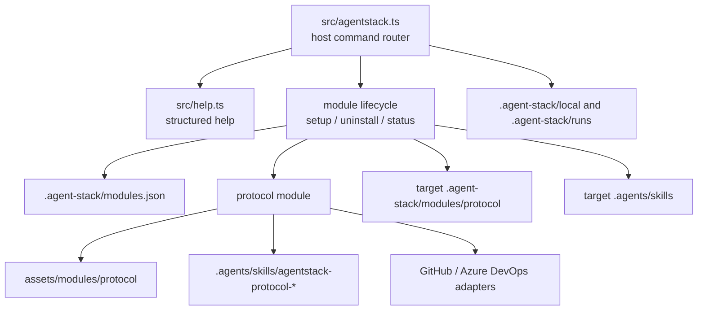

# Architecture

AgentStack is a modular CLI. The host CLI owns command routing, module lifecycle, help output, and shared local runtime. Built-in modules own their assets, commands, setup, uninstall, and workflow docs.



## Layers

- **Host CLI**: parses top-level commands, routes lifecycle operations, reports installed modules, and owns shared runtime paths.
- **Module registry**: maps module ids to setup, uninstall, status, owned paths, and activated commands.
- **Protocol module**: provides tracker-backed autonomous workflow commands and assets.
- **Tracker adapters**: translate protocol operations into GitHub or Azure DevOps calls.

## Repository Layout

```text
.agent-stack/
  modules.json
  local/
  runs/
  modules/
    protocol/
assets/modules/protocol/
assets/modules/protocol/skills/
assets/install/
assets/root/
.agents/
  skills/
```

Host-owned files:

- `.agent-stack/modules.json`
- `.agent-stack/local/`
- `.agent-stack/runs/`
Source-only package assets:

- `assets/install/setup-agent-stack.mjs`
- `assets/root/agent-stack.gitignore`
- `assets/modules/protocol/`
- `assets/modules/protocol/skills/`

Deployable protocol source files live under `assets/modules/protocol`. Installed protocol files live under target `.agent-stack/modules/protocol`. Protocol-owned files are documented in [Protocol Assets](modules/protocol/assets.md).

## Module Lifecycle

Install:

```sh
agentstack setup protocol ...
```

Uninstall:

```sh
agentstack uninstall protocol
```

Each module must remove only its owned paths and update `.agent-stack/modules.json`. Shared paths are preserved unless the module documents a safe purge mode and the caller requests it.

## Protocol Module

Protocol-specific architecture, command flow, policy, mapping, and tracker behavior live in [Protocol Architecture](modules/protocol/architecture.md).
