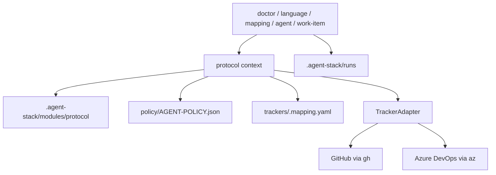

# Protocol Architecture

The protocol module provides the existing AgentStack autonomous workflow.

## Source Map

| Path | Role |
| --- | --- |
| `src/agentstack.ts` | Host router plus protocol command handlers. |
| `src/help.ts` | Structured help for global and protocol commands. |
| `src/model.ts` | Canonical work item, relation, claim, platform, and protocol state types. |
| `src/protocol.ts` | Eligibility checks, claim creation, and claim token validation. |
| `src/policy.ts` | Recommended execution policy defaults. |
| `src/tracker.ts` | Tracker adapter interface. |
| `src/github.ts` | GitHub tracker adapter. |
| `src/azure-devops.ts` | Azure DevOps tracker adapter. |
| `src/language/*` | Canonical language, mapping, and validation. |

## Runtime State

The module reads installed assets from `.agent-stack/modules/protocol` and writes shared local runtime under `.agent-stack/local` and `.agent-stack/runs`.

## Tracker Boundary

Protocol commands use the active tracker config and mapping. Agents should use the `agentstack` CLI for normal protocol operations instead of tracker-native CLIs.
