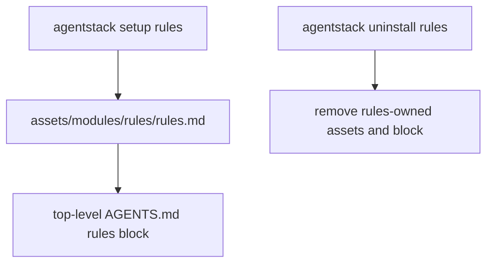

# Rules Architecture

The rules module manages a repository-owned rules block in root `AGENTS.md`.



## Boundaries

- The module source template is `assets/modules/rules/rules.md`.
- The template content and internal structure may evolve between AgentStack versions.
- Setup treats the template as opaque text and injects it verbatim; it does not depend on rule count, headings, or formatting.
- Repository-specific instructions are not part of the rules template.
- Setup does not copy the template into `.agent-stack/`; the managed block in root `AGENTS.md` is the installed content.
- Root `AGENTS.md` contains one rules-managed block delimited by compact, module-scoped markers:

```text
<!-- as:rules -->
<!-- /as:rules -->
```

- The rules-managed block is always the first content in root `AGENTS.md`.
- Setup and uninstall preserve all content outside the rules-managed block.
- Setup and uninstall fail without modifying the repository when only one marker exists, markers are duplicated, or their order is reversed.
- Rules setup does not modify nested `AGENTS.md` files or agent-specific instruction files.
- The package source template is used to refresh the managed block.

## Lifecycle

Setup replaces the existing rules-managed block when present, moves it to the top when necessary, and records the module in `.agent-stack/modules.json`.

Uninstall removes only the rules manifest entry and the rules-managed block. If no unrelated content remains, root `AGENTS.md` may be removed.
