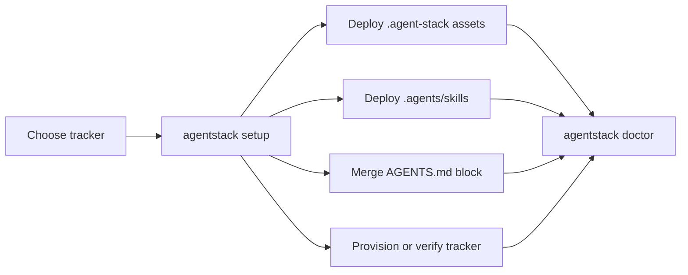
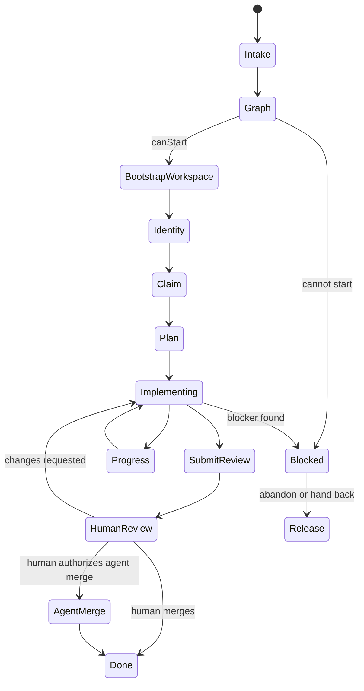
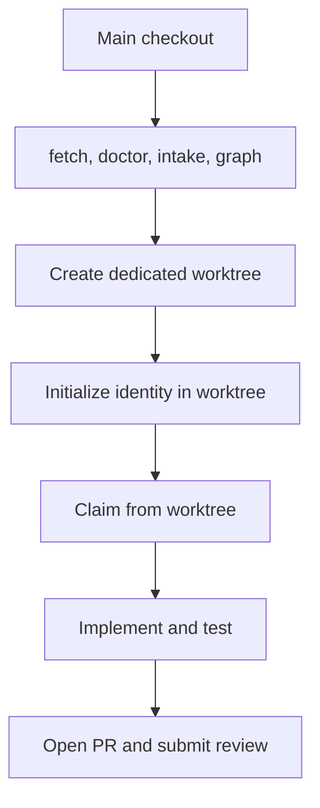
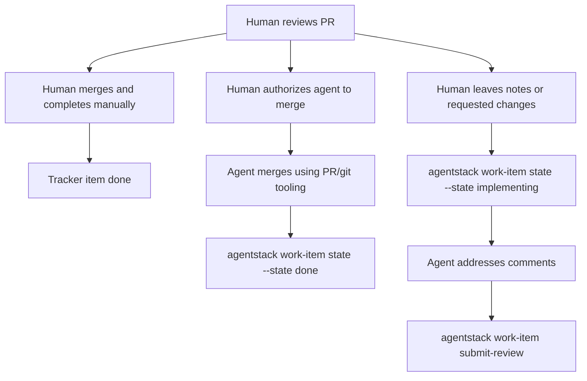

# Usage Manual

This manual explains the implemented AgentStack workflows. For exact command flags and output contracts, use [Command Reference](commands.md) or `agentstack help ... --json`.

## Setup Workflow



### GitHub

```sh
agentstack setup \
  --target /path/to/product-repo \
  --tracker github \
  --github-repository OWNER/REPO \
  --agents generic \
  --provision-tracker \
  --overwrite

agentstack doctor --repo /path/to/product-repo
```

`--provision-tracker` creates or updates default protocol labels for execution mode, readiness, type, state, claim, and priority.

### Azure DevOps

```sh
agentstack setup \
  --target /path/to/product-repo \
  --tracker azure-devops \
  --azdo-organization https://dev.azure.com/ORG \
  --azdo-project PROJECT \
  --agents generic \
  --provision-tracker \
  --overwrite

agentstack doctor --repo /path/to/product-repo
```

The default Azure DevOps profile uses tags and built-in relation types. Provisioning verifies Azure CLI access and configured project reachability.

If provisioning fails, verify access directly:

```sh
az extension add --name azure-devops
az devops project show --organization https://dev.azure.com/ORG --project PROJECT --output json
```

## Execution Policy

`.agent-stack/policy/AGENT-POLICY.json` contains repository-local gates for autonomous agents. The CLI loads this file for tracker-backed commands and merges it over built-in defaults.

Default policy:

```json
{
  "requireHumanReviewBeforeMerge": true,
  "requireAcceptanceCriteria": true
}
```

| Field | CLI effect |
| --- | --- |
| `requireAcceptanceCriteria` | Used by `work-item graph` and `work-item claim`. If true, an item without parsed acceptance criteria reports `missing-acceptance-criteria`, and claim refuses unless `--force` is used. |
| `requireHumanReviewBeforeMerge` | Returned by `work-item submit-review` as `reviewRequired`. |

Acceptance criteria are parsed from tracker descriptions. Supported formats include an `Acceptance Criteria:` inline section separated by semicolons, or an `Acceptance Criteria` / `Definition of Done` Markdown or HTML section with bullets, checkboxes, numbered items, or plain lines.

## Agent Execution Flow



Recommended sequence:

```sh
agentstack doctor
agentstack work-item get 123
agentstack work-item graph 123
agentstack agent identity init
agentstack work-item claim 123 --branch agentstack/123 --workspace ../repo-worktrees/123
agentstack work-item plan 123 --message "Implement the scoped behavior and validate it."
agentstack work-item progress 123 --message "Implementation started."
agentstack work-item submit-review 123 --pr https://github.com/OWNER/REPO/pull/456
```

Agents should use `agentstack` instead of calling tracker-native commands directly for normal protocol work.

## Agent Identity And Claim Tokens

Claims need an agent identity. You can provide one explicitly:

```sh
agentstack work-item claim 123 --agent codex/aless-laptop
```

Or let the CLI create a local identity:

```sh
agentstack agent identity init
agentstack agent identity show
agentstack work-item claim 123
```

The identity is stored in `.agent-stack/local/agent-identity.json` and should not be committed.

`claimToken` is different from `agentId`: `agentId` says who owns the claim, while `claimToken` proves ownership of that specific claim. Successful claims save the token locally under `.agent-stack/runs/<id>/claim.json`, so later commands can use it by default:

```sh
agentstack work-item release 123
```

Use `--agent` and `--claim-token` when running from CI or from a workspace that does not have local identity or claim state.

## Concurrent Agents

When multiple agents may work at the same time, each work item should use a dedicated git worktree or equivalent isolated workspace. The main checkout should be used for setup, fetch, intake, and orchestration. Implementation should happen in the per-item worktree.



Worktree bootstrap uses `.agent-stack/workspace.json` for optional defaults:

```json
{
  "baseBranch": null,
  "worktreeRoot": null
}
```

If `baseBranch` is omitted, use the repository default branch from `origin/HEAD`, then fall back to `origin/main`, `origin/master`, `main`, or `master`. If `worktreeRoot` is omitted, use `../<repo>-worktrees`.

Recommended startup:

```sh
git fetch origin
agentstack work-item get 123
agentstack work-item graph 123

repo_name=$(basename "$(git rev-parse --show-toplevel)")
worktree_root="../${repo_name}-worktrees"
base_branch=$(git symbolic-ref --quiet --short refs/remotes/origin/HEAD || echo origin/main)
mkdir -p "$worktree_root"
git config --global --add safe.directory "$(cd "$worktree_root" && pwd -P)/*"
git worktree add "${worktree_root}/123" -b agentstack/123 "$base_branch"
cd "${worktree_root}/123"

agentstack agent identity init
agentstack work-item claim 123 --branch agentstack/123 --workspace "${worktree_root}/123"
agentstack work-item plan 123 --message "Implement the scoped behavior and validate it."
```

Claim from inside the worktree that will perform the implementation. This keeps the identity file, claim token, git index, branch, build artifacts, and runtime state isolated from other agents.

If Git reports dubious ownership inside a worktree, add the concrete path as a fallback:

```sh
git config --global --add safe.directory "$(pwd -P)"
```

After removing a worktree that used a concrete fallback entry, clean up that exact value:

```sh
git config --global --fixed-value --unset-all safe.directory "$(cd "$worktree_root" && pwd -P)/123"
```

Keep the repo-scoped wildcard entry while the worktree root is still in use.

## Blockers And Release

Use `block` when work cannot continue without a decision, dependency, credential, clarification, or external fix:

```sh
agentstack work-item block 123 --reason "Cannot verify deployment because staging credentials are unavailable."
```

Use `release` when the agent is abandoning or handing back the work:

```sh
agentstack work-item release 123
```

Historical claim comments remain for audit, but released claims are no longer active.

## Review Submission

After implementation and validation, open a pull request and submit the work for human review:

```sh
agentstack work-item submit-review 123 \
  --pr https://github.com/OWNER/REPO/pull/456 \
  --summary "Implemented scoped behavior, updated tests, and ran npm test."
```

The command links the PR, writes a review submission report, sets protocol state `pr-open`, and returns `reviewRequired` based on policy.

## Post-Review Outcomes

After human review, there are three supported operating patterns. AgentStack currently provides `submit-review`, `progress`, and generic `state` transitions; it does not yet provide a dedicated `merge`, `complete`, or `changes-requested` command.



### Human Merges And Completes Manually

Use this when policy requires human-controlled merge or the reviewer wants to finish the item directly.

1. Merge the pull request in GitHub or Azure DevOps.
2. Complete the tracker item manually:
   - GitHub: close the issue if that is the team's completion signal, and set the mapped protocol state to `done` if using AgentStack labels.
   - Azure DevOps: move the work item to the team's completed state, and set the mapped protocol state/tag to `done` if using AgentStack tags.
3. Remove the active claim marker manually if the tracker still shows one:
   - GitHub default profile: remove `claim:active`.
   - Azure DevOps default profile: remove `claim:active` from tags.

If the human prefers to use the CLI for only the protocol state, run:

```sh
agentstack work-item state 123 --state done
```

This sets the AgentStack protocol state. It does not merge the PR, close a GitHub issue, move an Azure Boards state, or remove the active claim marker.

### Human Authorizes The Agent To Merge And Complete

Use this when review is approved and the human explicitly wants the agent to finish the mechanics.

The human should leave an unambiguous instruction in the PR, tracker item, or chat, for example:

```text
Review approved. Agent may merge the PR and complete work item 123.
```

The agent should then:

1. Re-check the PR status and required checks with the repository's normal PR tooling.
2. Merge the PR using GitHub or Azure DevOps tooling, according to the repository's merge policy.
3. Synchronize AgentStack state:

```sh
agentstack work-item progress 123 --message "Review approved. PR merged; marking the work item done."
agentstack work-item state 123 --state done
```

If the active claim marker should be cleared, the claiming agent can also run:

```sh
agentstack work-item release 123
```

Today `release` means "remove the active claim marker" and writes a release comment. It is primarily intended for abandon or handoff, so teams that want a cleaner successful-completion audit trail should prefer a future dedicated `complete` command instead of overloading release.

### Human Requests Changes

Use this when the review has notes, comments, or requested changes and the PR should not be merged yet.

The human should leave actionable review comments in the PR and, if needed, a short tracker or chat instruction:

```text
Changes requested. Address the PR review comments, keep work item 123 open, and resubmit for review.
```

The agent should then move the protocol state back to implementation and record what it is doing:

```sh
agentstack work-item state 123 --state implementing
agentstack work-item progress 123 --message "Review changes requested. Addressing PR comments before resubmitting."
```

After addressing the comments and updating the PR, the agent submits review again:

```sh
agentstack work-item submit-review 123 \
  --pr https://github.com/OWNER/REPO/pull/456 \
  --summary "Addressed review comments and reran validation."
```

If the requested changes reveal a blocker rather than normal follow-up work, use `block` instead:

```sh
agentstack work-item block 123 --reason "Review requested a product decision before implementation can continue."
```

## Validation

```sh
agentstack doctor
agentstack language validate
agentstack mapping validate
```

`doctor` validates the repository-local `.agent-stack` structure and rejects tracker configs that still contain placeholders such as `OWNER/REPO`.

## Local No-Mutation Setup Test

This flow tests repository setup without mutating a live tracker:

```sh
npm run build

node dist/agentstack.js setup \
  --target ./tmp-agentstack-target \
  --tracker github \
  --github-repository OWNER/REPO \
  --agents generic \
  --overwrite

node dist/agentstack.js doctor --repo ./tmp-agentstack-target
node dist/agentstack.js language validate --repo ./tmp-agentstack-target
node dist/agentstack.js mapping validate --repo ./tmp-agentstack-target
```

## Live GitHub Smoke Test

This flow creates a disposable private repository, installs AgentStack Protocol into it, provisions labels, and exercises the basic protocol commands against one issue.

```sh
gh auth status
gh repo create OWNER/agentstack-smoke --private --clone
cd agentstack-smoke

agentstack setup \
  --tracker github \
  --github-repository OWNER/agentstack-smoke \
  --agents generic \
  --provision-tracker \
  --overwrite

agentstack doctor --repo .
agentstack language validate --repo .
agentstack mapping validate --repo .
agentstack agent identity init --agent codex-smoke --repo .

gh issue create \
  --title "AgentStack smoke test" \
  --body "## Acceptance Criteria
- Smoke claim works
- Smoke progress works
- Smoke submit-review works" \
  --label exec:agent \
  --label ready:agent \
  --label state:ready \
  --label type:task

agentstack work-item get 1 --repo .
agentstack work-item graph 1 --repo .
agentstack work-item claim 1 --repo .
agentstack work-item progress 1 --message "Smoke claim succeeded." --repo .
agentstack work-item plan 1 --message "Smoke-test the AgentStack protocol command flow." --repo .
agentstack work-item submit-review 1 --pr https://github.com/OWNER/agentstack-smoke/pull/1 --summary "Smoke flow completed through submit-review." --repo .
```

The claim should not need `--force` when the item is in `ready` state, has no active claim or open blockers, and includes parseable acceptance criteria.

## Live Azure DevOps Smoke Test

This flow uses a disposable Azure DevOps project or test area.

```sh
az login
az extension add --name azure-devops
az devops project show --organization https://dev.azure.com/ORG --project PROJECT --output json

mkdir agentstack-azdo-smoke
cd agentstack-azdo-smoke
git init

agentstack setup \
  --tracker azure-devops \
  --azdo-organization https://dev.azure.com/ORG \
  --azdo-project PROJECT \
  --agents generic \
  --provision-tracker \
  --overwrite

agentstack doctor --repo .
agentstack language validate --repo .
agentstack mapping validate --repo .
agentstack agent identity init --agent codex-smoke --repo .
```

Create a smoke work item with protocol tags:

```sh
az boards work-item create \
  --organization https://dev.azure.com/ORG \
  --project PROJECT \
  --type Task \
  --title "AgentStack smoke test" \
  --description "Acceptance Criteria: Smoke claim works; Smoke progress works; Smoke submit-review works" \
  --fields "System.Tags=exec:agent; ready:agent; state:ready; type:task"
```

Use the created work item `id`:

```sh
agentstack work-item get <id> --repo .
agentstack work-item graph <id> --repo .
agentstack work-item claim <id> --repo .
agentstack work-item progress <id> --message "Smoke claim succeeded." --repo .
agentstack work-item plan <id> --message "Smoke-test the AgentStack protocol command flow." --repo .
agentstack work-item submit-review <id> --pr https://dev.azure.com/ORG/PROJECT/_git/REPO/pullrequest/1 --summary "Smoke flow completed through submit-review." --repo .
```

## Troubleshooting

| Symptom | Likely cause | Fix |
| --- | --- | --- |
| `missing-acceptance-criteria` | Policy requires parsed acceptance criteria. | Add an `Acceptance Criteria` or `Definition of Done` section to the tracker item. |
| Placeholder config error | Tracker config still contains `OWNER/REPO`, `ORG`, or `PROJECT`. | Re-run `agentstack setup ... --overwrite` with real tracker values. |
| GitHub provisioning fails | `gh` is missing, unauthenticated, or lacks repository permission. | Run `gh auth status`, then retry setup. |
| Azure DevOps provisioning fails | Azure CLI extension/auth/project access problem. | Run `az extension add --name azure-devops` and `az devops project show ...`. |
| Claim refused | Existing claim, blocked dependency, non-ready state, human-only execution, or missing acceptance criteria. | Run `agentstack work-item graph <id>` and address the listed `reasons`. |
| Release cannot find token | Command is running outside the workspace that claimed the item. | Provide `--claim-token` or run release from the claiming workspace. |
| Git dubious ownership | Worktree path is not trusted by Git. | Add a repo-scoped safe-directory wildcard or concrete fallback path. |
